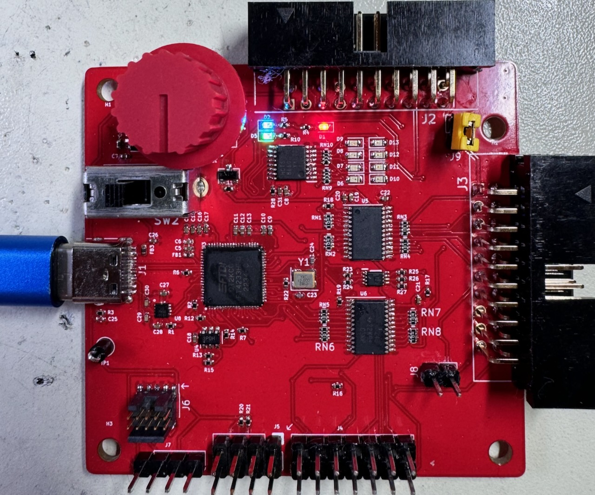

<h1 align="center">
   
    <a>SERBERUS</a>
</h1>

<h4 align="center">Multi-headed and Multi-Protocol embedded system hacking tool.</h4>

  
   

# Overview
- The Serberus is a serial Man-in-the-Middle hardware hacking tool
- It has 4 channels, based on the FTDI 4233
- Has the ability to connect to JTAG, SPI, I2C and SWD interfaces
- Has a Level shifter and switch to allow you to connect to logic voltages of 1.8, 2.5 and 3.3v or any arbitrary voltage between 1.65v and 5.5v
## System Requirements
No drivers should be required, the FTDI devices are supported by most operating systems.
The UART ports will work right away with screen, putty or your favorite serial console application.
## What makes the Serberus unique is the following:
- 3 UART Ports
- J-Link Compatible JTAG connector - use any of those J-link to XXX connectors or breakouts
- Indicators for each of the 4 serial channels - help debugging
- 2.54 MM Logic Analyzer connector - Easily connect the most common logic analyzers or an MSO scope
## UART
The top connector has 3 UART connections, the first UART has all 7 signal pins connected, for those rare instances where they are needed. The first UART is mapped to the first 4233 channel.
 
The second and third UARTS are mapped to the 3rd and 4th channels ports, as the second is used by the combined JTAG/SWD/I2C and SPI port. These ports only have TX and RX connected.
## JTAG
todo
## SPI
todo
## I2C
todo
## SWD
todo
## Logc Analyzer
The 14 pin header at the bottom next to the SPI and I2C connectors replicates most of the signal lines for easy connection to a logic analyzer or digital MSO lines of an oscilloscope.

## License
Released under the Apache 2.0 License all gerbers and Kicad project files are attached
## How do I get one? 

Please be patient, more information coming soon, in the meantime, please feel free to grab the designs and make your own.
